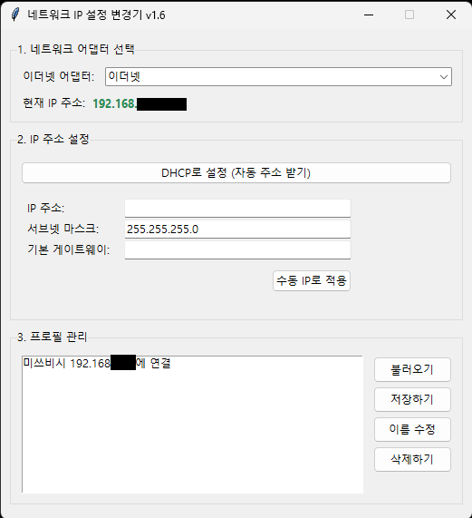

# IP Changer (네트워크 IP 설정 변경기)

[](https://www.gnu.org/licenses/gpl-3.0)

수동으로 IP 주소를 변경하는 번거로움을 해결하기 위해 Gemini 2.5 Pro의 도움을 받아 제작한 Windows용 GUI 프로그램입니다.


*(▲ 프로그램의 스크린샷을 `screenshot.png` 이름으로 저장하여 깃허브에 함께 올려주세요)*

## ✨ 주요 기능 (Key Features)

* **자동 어댑터 감지**: 현재 활성화된 유선 이더넷 어댑터를 자동으로 감지하여 목록으로 보여줍니다.
* **원클릭 DHCP 설정**: 버튼 하나로 선택된 어댑터를 즉시 DHCP 모드로 전환합니다.
* **수동 IP 설정**: IP 주소, 서브넷 마스크, 게이트웨이를 직접 입력하여 고정 IP로 설정할 수 있습니다.
* **현재 IP 주소 표시**: 어댑터 선택 시, 해당 어댑터의 현재 IPv4 주소를 실시간으로 표시합니다.
* **프로필 관리**: 자주 사용하는 고정 IP 설정을 저장, 불러오기, 이름 수정, 삭제할 수 있습니다.
* **관리자 권한 자동 요청**: 실행 시 관리자 권한(UAC)을 자동으로 요청하여 편리합니다.

## 🚀 사용법 (How to Use)

### 1. 일반 사용자 (실행 파일)

1.  이 깃허브 페이지 오른쪽의 **[Releases](https://github.com/Hard-boiled-eggs/IP_Changer/releases)** 메뉴로 이동합니다.
    *(▲ 위 링크는 사용자님의 깃허브 주소로 예시를 만든 것입니다. 실제 주소로 수정해주세요.)*
2.  가장 최신 버전의 `ip_changer.exe` 파일을 다운로드합니다.
3.  다운로드한 파일을 실행합니다. (별도의 설치가 필요 없습니다.)

### 2. 개발자 (소스 코드 직접 실행)

#### 시스템 요구사항
* **운영체제**: Windows 7, 8, 8.1, 10, 11
* **Python 버전**: Python 3.6+ (Windows 7/8 호환성을 위해 **Python 3.8** 권장)
* **필수 라이브러리**: `psutil`

#### 설치 및 실행
1.  이 저장소를 클론하거나 소스 코드를 다운로드합니다.
2.  명령 프롬프트(CMD)에서 `psutil` 라이브러리를 설치합니다.
    ```bash
    pip install psutil
    ```
3.  스크립트를 실행합니다.
    ```bash
    python ip_changer.pyw
    ```

<br>

<details>
<summary><b>📖 프로그램 상세 설명서 펼치기/접기</b></summary>

---
### 네트워크 IP 설정 변경기 - 프로그램 설명서
*문서 기준 버전: 1.6*

#### 1. 개요 (Overview)
네트워크 IP 설정 변경기는 Windows 운영체제에서 유선 이더넷(Ethernet) 어댑터의 IP 주소 설정을 간편하게 변경할 수 있도록 제작된 파이썬 GUI 프로그램입니다. DHCP(자동 주소 할당) 모드와 다수의 고정 IP 프로필 사이를 자주 전환해야 하는 사용자를 위해 개발되었습니다. 이 프로그램은 복잡한 제어판 설정이나 `netsh` 명령어에 익숙하지 않은 사용자도 버튼 클릭 몇 번만으로 직관적으로 네트워크 환경을 변경할 수 있도록 돕는 것을 목표로 합니다.

#### 2. 사용 방법 (How to Use)
프로그램 인터페이스는 3개의 주요 섹션으로 나뉩니다.

**2.1. 네트워크 어댑터 선택**
* **이더넷 어댑터**: 드롭다운 목록에서 설정을 변경하고자 하는 유선 네트워크 어댑터를 선택합니다.
* **현재 IP 주소**: 어댑터를 선택하면 해당 어댑터에 현재 할당된 IPv4 주소가 녹색 굵은 글씨로 표시됩니다. 이를 통해 변경 전 상태를 확인할 수 있습니다.

**2.2. IP 주소 설정**
* **DHCP로 변경 시**:
    1.  **[DHCP로 설정]** 버튼을 클릭합니다.
    2.  확인 창이 나타나면 **[예]**를 누릅니다.
* **고정(수동) IP로 변경 시**:
    1.  `IP 주소`, `서브넷 마스크`, `기본 게이트웨이` 입력란에 원하는 정보를 모두 입력합니다.
    2.  **[수동 IP로 적용]** 버튼을 클릭합니다.

**2.3. 프로필 관리**
자주 사용하는 고정 IP 정보를 저장하고 관리하는 기능입니다.

* **저장하기**: '2. IP 주소 설정' 부분에 저장할 IP 정보를 모두 입력한 후, **[저장하기]** 버튼을 클릭하고 프로필 이름을 입력합니다.
* **불러오기**: 목록에서 프로필을 선택하고 **[불러오기]** 버튼을 클릭하면 정보가 입력란에 채워집니다.
    * **주의**: 정보를 불러온 후, 반드시 **[수동 IP로 적용]** 버튼을 눌러야 실제 설정이 변경됩니다.
* **이름 수정**: 목록에서 프로필을 선택하고 **[이름 수정]** 버튼을 클릭하여 새 이름을 입력합니다.
* **삭제하기**: 목록에서 프로필을 선택하고 **[삭제하기]** 버튼을 클릭합니다.

#### 3. 코드 구조 및 유지보수
* `ip_changer.pyw`: 프로그램의 모든 로직을 담고 있는 메인 스크립트 파일입니다.
* `network_profiles.json`: 사용자가 저장한 프로필 정보가 저장되는 파일입니다.
* **유지보수**: 향후 Windows 업데이트로 호환성 문제가 발생하면, `pip install --upgrade psutil` 명령어로 `psutil` 라이브러리를 업데이트하는 것으로 대부분 해결할 수 있습니다.

---
</details>

## 📜 라이선스 (License)

이 프로젝트는 **GNU General Public License v3.0** 라이선스를 따릅니다.
자세한 내용은 [COPYING](COPYING) 파일을 참고하세요.

## 👨‍💻 만든 사람 (Author)

* [삶과삶 (Hard-boiled-eggs)](https://github.com/Hard-boiled-eggs)
